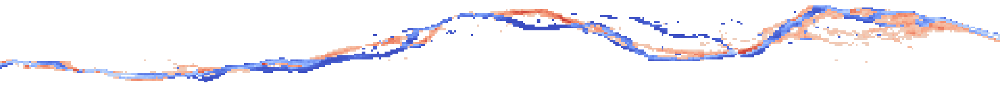

# AI-Powered Modeling of River Course Dynamics in Mountain Regions

[](https://opensource.org/licenses/MIT)
[](https://www.python.org/downloads/)
[](https://www.tensorflow.org/)

A comprehensive workflow for processing satellite imagery and predicting water bodies using a CNN-LSTM model that integrates remote sensing data with additional hydrological factors. This project focuses on monitoring river course shifts in alpine regions, specifically in the upper reaches of the Isar River. By leveraging data-driven techniques, this approach provides a valuable alternative to traditional physics-based hydrological models, particularly in data-sparse or topographically complex environments.

Predicting river course shifts in alpine regions is crucial for flood risk management, as changes in the riverbed can quickly create new flood-prone areas. Alterations in flow pathways may undermine or destroy nearby infrastructure — such as roads — simply through natural channel migration. From a conservation perspective, tracking these shifts allows for monitoring and forecasting changes in riparian habitat zones, which directly impact biodiversity. Early warning of channel migration supports proactive measures to protect both human assets and sensitive ecosystems. 


## Table of Contents
- [Project Overview](#project-overview)
- [Installation](#installation)
- [Data Sources](#data-sources)
- [Workflow](#workflow)
- [Model Architecture](#model-architecture)
- [Results](#results)
- [Future Improvements](#future-improvements)
- [License](#license)

## Project Overview

This project presents an end-to-end workflow for detecting and predicting water bodies using satellite imagery and hydrological data. The key components include:

- **Satellite Imagery Processing**: Retrieval and preprocessing of Sentinel-2 imagery via Google Earth Engine, including calculation of the Normalized Difference Water Index (NDWI), and masking of snow and ice.
- **Water Mask Creation**: Creation of binary water masks using custom thresholding methods.
- **Exogenous Data Integration**: Incorporation of hydrological variables such as precipitation and discharge to enhance model performance.
- **CNN-LSTM Model**: A deep learning architecture that combines Convolutional Neural Networks (CNNs) for spatial feature extraction with Long Short-Term Memory (LSTM) networks for temporal sequence modeling.
- **Visualization Tools**: Interactive tools for visualizing predicted water masks and tracking river course changes over time.

## Installation

### Prerequisites
- Python 3.11 or higher
- GDAL library installed on your system

### Setup

1. Clone this repository:
   ```bash
   git clone https://github.com/SchmEva357/ds-capstone-AI-powered.git
   cd ds-capstone-AI-powered
   ```

2. Install the required packages:
   ```bash
   pip install -r requirements.txt
   ```

## Data Sources

### Satellite Imagery
- **Sentinel-2 L2A**: Multi-spectral imagery obtained from Google Earth Engine, with a spatial resolution of 10 meters.
- **Time Period**: 2017-04-24 to 2025-03-31
- **Filtering**: Images with less than 30 % cloud coverage and 3 % snow cover.

### Additional Factors
- **Precipitation Data**: Obtained from Gewässerkundlicher Dienst Bayern (Krün)
- **Discharge Measurements**: Provided by Gewässerkundlicher Dienst Bayern (Vorderriß)
- **Temporal Resolution**: Daily measurements
- **Dataset Name**: `final_dataset.csv`. This file includes also the preprocessing steps.

## Workflow

The project workflow consists of five main steps (implemented in the notebook "Workflow", for further prediction use "model_usage" or host the local streamlit application with "hydro_streamlit.py"):

### 1. Satellite Imagery Retrieval and Preprocessing
- Retrieve Sentinel-2 L2A imagery from Google Earth Engine (GEE)
- Apply filters based on date range, cloud coverage and snow cover
- Compute the Normalized Difference Water Index (NDWI) during processing
- Export the processed imagery and relevant metadata to local storage for further analysis

### 2. Water Mask Creation
- Process NDWI outputs to generate binary water masks
- Apply an adaptive threshold to account for changing spectral reflectances due to atmospheric conditions
- Export masks as GeoTIFF files for downstream analysis

### 3. Data Preparation for Model Training
- Load water masks and reshape data to match model input dimensions
- Integrate additional factors (e.g. precipitation, discharge)
- One-hot encode temporal features (month)
- Split the dataset into training, validation and test set
- Implement data generators for efficient model training

### 4. Model Building and Training
- Construct a CNN-LSTM architecture to capture both spatial and temporal dependencies
- Incorporate additional factors as extra input layer
- Train the model using binary cross-entropy loss and Intersection over Union (IoU) as evaluation metric
- Save the trained model for inference and reproducibility

### 5. Visualization and Analysis
- Generate predictions of water masks on test data
- Create heatmaps to visualize river course shifts over time
- Evaluate model performance using accuracy metrics and qualitative comparison

## Model Architecture

The model employs a hybrid CNN-LSTM architecture to leverage both spatial and temporal features:

- **CNN Component**: Extracts spatial features from satellite imagery using 3D convolutional layers
  - 3D Convolutional layers with small kernel sizes (3x3x3) to capture fine spatial details
  - Max pooling layers with small pool sizes to preserve spatial resolution
  - 'Valid' padding used to maintain data integrity without introducing padding artifacts

- **LSTM Component**: Processes time-series data of exogenous factors to capture temporal dependencies
  - A single LSTM input layer with 16 units to model sequential patterns over time

- **Future Exogenous Input**: Incorporates future additional factors (e.g. retrieved from the weather forecast) during prediction
  - A dense layer with four units to process future inputs and integrate them into the model

- **Output**: A dense layer reshaped to match the original image dimensions
  - Sigmoid activation function for binary water mask prediction (0 for non-water, 1 for water)

### Model Summary:
- Input Layers: 5 consecutive satellite images, 5 additional factors and 1 future additional factor
- Output: Predicted water mask for the next time step
- Optimization: Adam optimizer for efficient training
- Loss Function: Binary cross-entropy to penalize missclassification
- Metrics: Accuracy and Intersection over Union (IoU) to evaluate model performance

## Results

The model successfully predicts river course shifts in the Isar riverbed, capturing seasonal variations and responses to extreme weather events. Key findings include:

- **Spatial Accuracy**: The model accurately maps the spatial distribution of river course shifts, especially in regions with well-defined river channels.
- **Temporal Dynamics**: Incorporating additional factors enhance the model's ability to predict changes in the river course dynamics caused by erosion and sedimentation processes.
- **Limitations**: The model's performance is constrained by the resolution of Sentinel-2 imagery (10 meters), which may not capture very narrow water channels.


*Example for the prediction of river course shift over time. Blue areas indicate the future river course, while red areas are going to be disminshed.*

## Future Improvements

The following improvements could enhance the project:

- **Digital Elevation Model (DEM)**: By incorporating the DEM, preferential river paths can be identified. Furthermore, the DEM can be updated  to reflect changes caused by erosion and sedimentation processes. 
- **Loss Function**: Implement Dice Loss or a combination of Dice Loss and binary cross-entropy to better handle imbalanced datasets.
- **Multi-Sensor Data Fusion**: Integrate Sentinel-1 SAR data for enhanced cloud-penetration capabilities.
- **Advanced Architectures**: Explore U-Net or Transformer-based models for improved spatial feature extraction.
- **Uncertainty Quantification**: Implement methods to quantify prediction uncertainty.
- **Enhanced Hydrological Components**: Include lagged variables to capture broader hydrological trends and improve predictive accuracy.
- **Explainability**: Implement techniques such as saliency maps to improve model interpretability and provide insights into decision-making.
- **Resolution Enhancement**: Investigate super-resolution techniques to improve the effective resolution of water body detection, particularly for fine-scale features.

## License

This project is licensed under the MIT License - see the LICENSE file for details.

## Citation

If you use this code in your research, please cite: https://github.com/SchmEva357


## Acknowledgments

- Gewässerkundlicher Dienst Bayern for providing discharge data
- Open-Meteo for climate data
- Google Earth Engine for satellite imagery access
